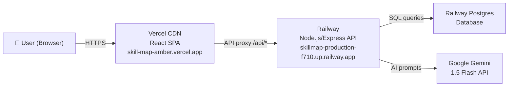
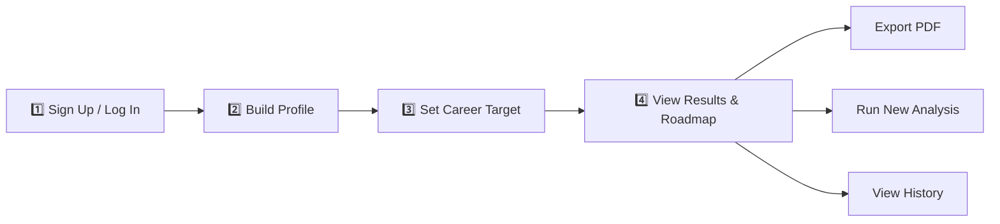
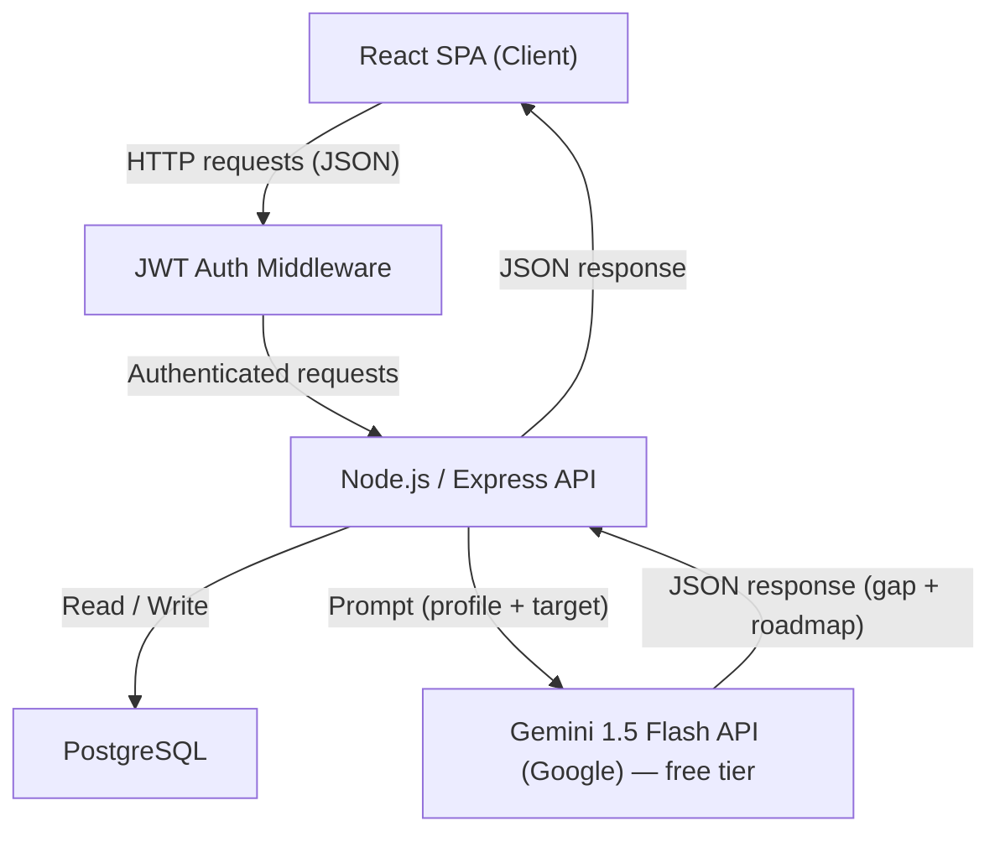
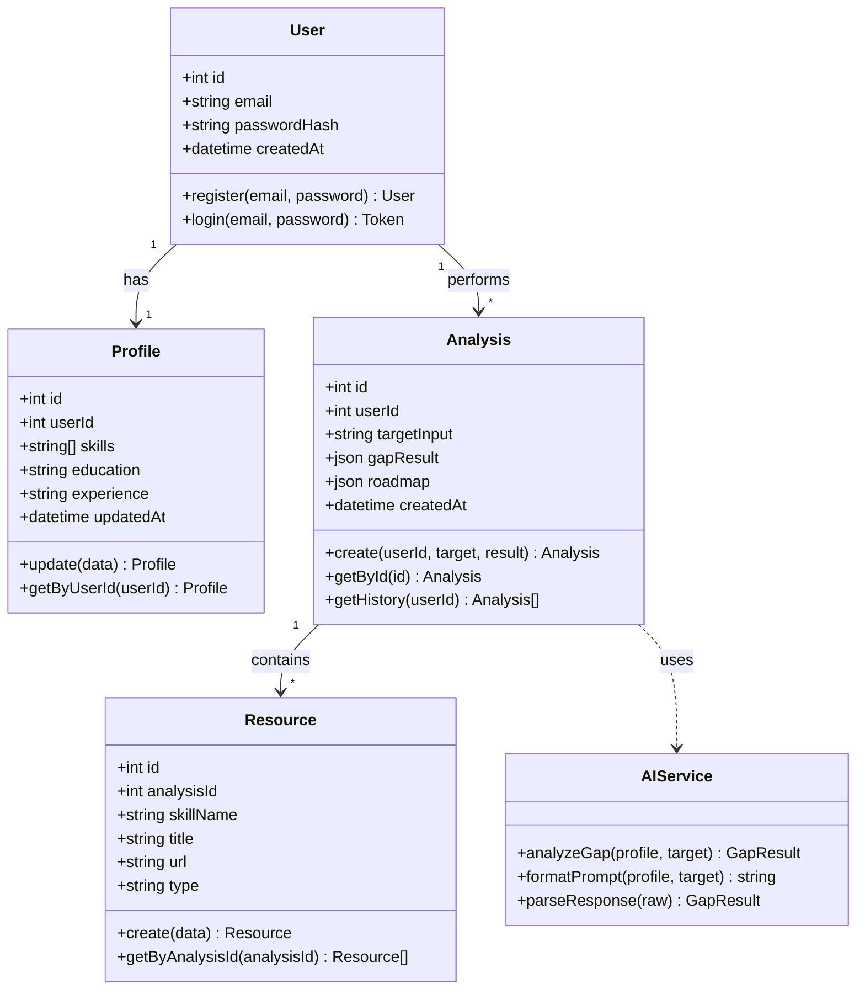
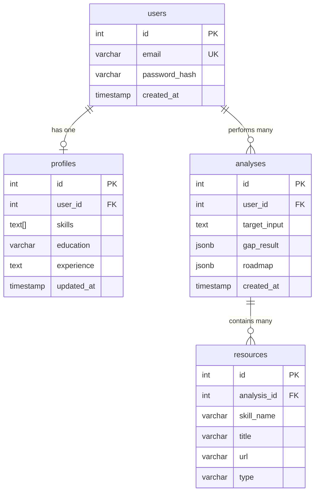
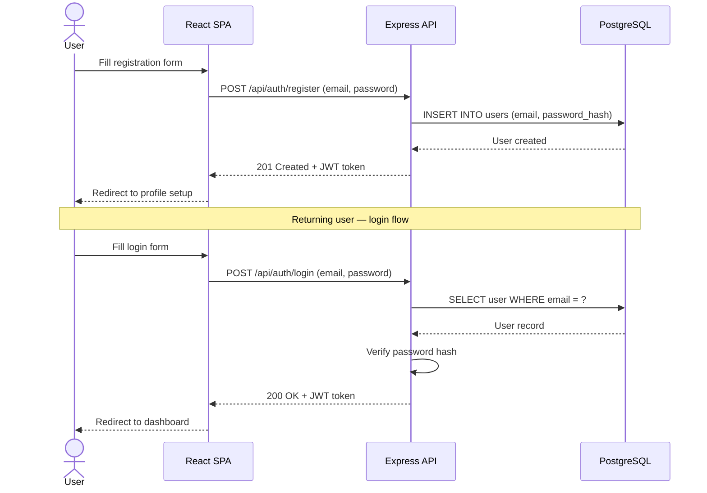
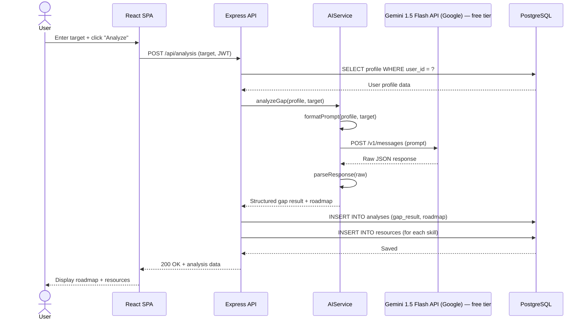
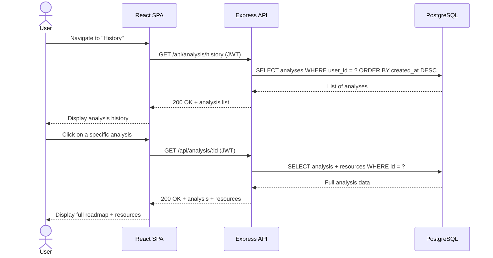

# 🗺️ SkillMap — Personalized Career Learning Roadmap Creator

[](https://github.com/lucasscianna/SkillMap/actions)
[](https://skill-map-amber.vercel.app)
[](https://skillmap-production-f710.up.railway.app/api/health)

SkillMap is a web application that analyzes the gap between a user's current skills/profile and their target career goal, generating a personalized chronological learning roadmap with curated resources (courses, projects, readings).

> [!IMPORTANT]
> **🌐 Live Production URLs:**
> - **Frontend (Vercel):** [https://skill-map-amber.vercel.app](https://skill-map-amber.vercel.app)
> - **Backend API (Railway):** [https://skillmap-production-f710.up.railway.app/api/health](https://skillmap-production-f710.up.railway.app/api/health)
> - **GitHub Repository:** [https://github.com/lucasscianna/SkillMap](https://github.com/lucasscianna/SkillMap)

> [!NOTE]
> **Resilient Mock Fallback:** The application has a dual-layer reliability strategy. The backend includes a `mockService` that activates when no `GEMINI_API_KEY` is configured. Additionally, the frontend has an automatic API fallback mechanism — if the backend is unreachable or returns errors, the frontend seamlessly switches to realistic mock data, ensuring the full user experience is always accessible and demonstrable.

## 🚀 Quick Start / Local Installation

Follow these steps to get SkillMap running on your local machine.

### 📋 Prerequisites
- **Node.js** (v18 or higher recommended)
- **PostgreSQL** database running locally or remotely

### 🗄️ 1. Database Setup
Create a PostgreSQL database named `skillmap`:
```sql
CREATE DATABASE skillmap;
```
Then, execute the schema migration script located in `backend/src/db/migrations.sql` against your new database to create the required tables (`users`, `profiles`, `analyses`, `resources`).

### ⚙️ 2. Environment Setup

#### Backend configuration:
Create a `.env` file in the `backend` directory (you can copy `backend/.env.example` as a template):
```env
PORT=5002
DATABASE_URL=postgresql://<username>:<password>@localhost:5432/skillmap
JWT_SECRET=supersecretkeyforjwtdev123
AI_PROVIDER=gemini
GEMINI_API_KEY=your_gemini_api_key_here # Optional: if empty, Mock Mode will automatically activate
```

### 🏃‍♂️ 3. Running the Application

Open two terminal windows:

#### Start the Backend API:
```bash
cd backend
npm install
npm run dev
```
The API server will start on `http://localhost:5002`. You should see `SkillMap API running on port 5002`.

#### Start the Frontend Web App:
```bash
cd frontend
npm install
npm run dev
```
The Vite development server will start on `http://localhost:3000`. Open your browser and navigate to `http://localhost:3000`.

### 🧪 Running Tests

#### Backend unit tests (Jest):
```bash
cd backend
npm test
```

#### Frontend component tests (Vitest):
```bash
cd frontend
npm test
```
---

## 🌐 Deployment Architecture

The application is deployed using a split architecture with separate services for frontend and backend:



| Component | Service | URL | Configuration |
|-----------|---------|-----|---------------|
| **Frontend** | Vercel | [skill-map-amber.vercel.app](https://skill-map-amber.vercel.app) | Root Directory: `frontend`, Framework: Vite, Auto-deploy on push to `main` |
| **Backend API** | Railway | [skillmap-production-f710.up.railway.app](https://skillmap-production-f710.up.railway.app/api/health) | Root Directory: `backend`, Nixpacks builder, Auto-deploy on push to `main` |
| **Database** | Railway Postgres | Internal connection via `DATABASE_URL` | Managed PostgreSQL instance with persistent volume |
| **CI/CD** | GitHub Actions | [Workflow runs](https://github.com/lucasscianna/SkillMap/actions) | Runs Jest + Vitest on every push to `main`/`develop` |

> [!TIP]
> **Resilience:** The frontend includes a smart API fallback — if the Railway backend is temporarily unavailable, the frontend automatically switches to mock data so the full user experience remains functional. This is logged in the browser console as `[SkillMap] Backend error (…) — using mock data`.

---

## 📁 Project Structure

```
SkillMap/
├── .github/
│   └── workflows/
│       └── ci.yml                  # GitHub Actions CI pipeline
├── backend/
│   ├── src/
│   │   ├── controllers/
│   │   │   ├── authController.js   # Register + login logic
│   │   │   ├── profileController.js# Profile CRUD
│   │   │   └── analysisController.js# Gap analysis orchestration
│   │   ├── routes/
│   │   │   ├── auth.js             # POST /api/auth/register, /api/auth/login
│   │   │   ├── profile.js          # GET/PUT /api/profile
│   │   │   └── analysis.js         # POST /api/analysis, GET /api/analysis/:id, history
│   │   ├── services/
│   │   │   ├── geminiService.js    # Gemini 1.5 Flash API integration
│   │   │   ├── mockService.js      # Multi-industry mock fallback
│   │   │   └── ollamaService.js    # Local AI alternative (dev)
│   │   ├── middleware/
│   │   │   └── auth.js             # JWT verification middleware
│   │   ├── db/
│   │   │   ├── index.js            # PostgreSQL connection pool
│   │   │   └── migrations.sql      # Database schema (4 tables)
│   │   └── index.js                # Express server entry point
│   ├── tests/
│   │   ├── auth.test.js            # Auth endpoint tests
│   │   ├── profile.test.js         # Profile endpoint tests
│   │   └── aiService.test.js       # AI service tests
│   ├── package.json
│   └── railway.json                # Railway deployment config
├── frontend/
│   ├── src/
│   │   ├── components/
│   │   │   ├── AuthForm.jsx        # Login/signup form
│   │   │   ├── ProfileForm.jsx     # Profile editor with tag input
│   │   │   ├── TargetInput.jsx     # Job title / description input
│   │   │   ├── AnalysisLoader.jsx  # Loading animation
│   │   │   ├── RoadmapDisplay.jsx  # Skill gap roadmap timeline
│   │   │   ├── ResourceCard.jsx    # Learning resource card
│   │   │   ├── ExportButton.jsx    # PDF export trigger
│   │   │   ├── Navbar.jsx          # Top navigation
│   │   │   ├── SideNavBar.jsx      # Sidebar navigation
│   │   │   └── MainLayout.jsx      # Page layout wrapper
│   │   ├── pages/
│   │   │   ├── ProfilePage.jsx     # Step 2: Profile setup
│   │   │   ├── AnalysisPage.jsx    # Step 3: Target + launch analysis
│   │   │   ├── ResultsPage.jsx     # Step 4: Gap results + roadmap
│   │   │   ├── HistoryPage.jsx     # Past analyses grid
│   │   │   └── ExportPage.jsx      # PDF preview + export
│   │   ├── services/
│   │   │   └── api.js              # Axios instance + mock fallback
│   │   ├── tests/
│   │   │   ├── AuthForm.test.jsx
│   │   │   ├── RoadmapDisplay.test.jsx
│   │   │   └── ResourceCard.test.jsx
│   │   ├── App.jsx                 # Router + route definitions
│   │   ├── main.jsx                # React entry point
│   │   └── index.css               # Global styles + design system
│   ├── package.json
│   ├── vite.config.js              # Vite config + dev proxy
│   └── vercel.json                 # Vercel deployment config
├── assets/
│   └── mockups/                    # Interactive HTML mockups
└── README.md                       # This file
```

---

## 🔄 How the Application Works

### User Flow

The complete user journey follows a 4-step pipeline:



1. **Authentication** — User registers or logs in. Password is hashed with `bcrypt` (12 rounds). A signed JWT is returned and stored in `localStorage`.
2. **Profile Setup** — User enters their skills (tag-based), education, and experience. Data is stored in PostgreSQL via `PUT /api/profile`.
3. **Career Target** — User types a job title or pastes a full job description. Clicking "Analyze" triggers `POST /api/analysis`.
4. **Gap Analysis** — The backend fetches the user's profile, constructs a structured prompt, calls the Gemini 1.5 Flash API, parses the JSON response into `gaps`, `roadmap`, and `resources`, stores everything in PostgreSQL, and returns the result to the frontend.
5. **Results** — The frontend displays a match percentage, skill gaps by priority (high/medium/low), a chronological learning roadmap with estimated durations, and curated resource cards.
6. **Export** — The user can export the roadmap as a print-optimized PDF or navigate to their analysis history.

### Security

| Mechanism | Implementation |
|-----------|---------------|
| Password storage | `bcrypt` hash with 12 salt rounds — plaintext passwords are never stored |
| Authentication | Stateless JWT tokens (signed with `HS256`) — no server-side sessions |
| Route protection | `middleware/auth.js` verifies JWT on every protected endpoint |
| Input validation | Server-side validation on all API inputs before database insertion |
| CORS | Configured via `cors` middleware to allow frontend origin |

---

## 🧪 Testing Strategy

### Test Architecture

| Layer | Tool | Files | What's Tested |
|-------|------|-------|---------------|
| **Backend Unit Tests** | Jest + Supertest | `auth.test.js`, `profile.test.js`, `aiService.test.js` | Auth endpoints, profile CRUD, AI prompt formatting, response parsing |
| **Frontend Component Tests** | Vitest + React Testing Library | `AuthForm.test.jsx`, `RoadmapDisplay.test.jsx`, `ResourceCard.test.jsx` | Form rendering, tab switching, roadmap display, resource cards |
| **API Integration Testing** | Postman | Manual collection | All 7 endpoints — happy path + error cases (400, 401, 404) |
| **End-to-End** | Manual QA | Full user flow | Register → Profile → Analysis → Results → Export on Chrome/Firefox |
| **CI/CD** | GitHub Actions | `.github/workflows/ci.yml` | Automated test runs on every push to `main`/`develop` |

### How to Run Tests

```bash
# Backend tests (Jest)
cd backend && npm test

# Frontend tests (Vitest)
cd frontend && npm test
```

### Test Results

All test suites pass consistently. CI pipeline results are visible at [GitHub Actions](https://github.com/lucasscianna/SkillMap/actions).

---

## 0. 🧑‍💻 Team Formation & Role Definition

**Team Member:**

| Name | Role | Responsibilities |
|------|------|-----------------|
| Lucas Scianna | Fullstack Developer & Project Manager | Architecture, frontend, backend, API integration, planning, task tracking |

SkillMap is a solo project — approved by Holberton School. Having one person handle both development and project management was a deliberate choice: it removes coordination overhead, keeps decision-making fast, and gives full ownership over every layer of the product. There's no handoff, no waiting on someone else, no miscommunication between teams. Everything moves at the same pace.

### Communication & Collaboration Tools

- **GitHub Projects** — main task board, used for sprint planning and progress tracking
- **Notion** — documentation hub (specs, notes, research, design decisions)
- **Discord** — async communication with the project coach and reviewers

### Collaboration Standards

- Daily commits with clear, descriptive messages
- One-week sprints with defined deliverables
- Personal code review at the end of each sprint — reviewing my own PRs before merging, checking for consistency and quality
- No external stakeholders involved in this project

---

## 1. 💡 Brainstorming & Idea Evaluation

### Step 1 — Ideas Explored

Before settling on SkillMap, I went through a bunch of different ideas. Some were tools I personally wanted, others came from problems I noticed around me. Here are the ones that made it furthest:

1. **FocusFlow** — A work timer with built-in task prioritization and weekly productivity stats. Basically a Pomodoro on steroids.
2. **MeetingMind** — Upload a meeting transcript, and the tool pulls out action items, decisions, and follow-ups automatically.
3. **HabitCoach** — A habit tracker that doesn't just log your habits but gives you personalized feedback on what's working and what isn't.
4. **Decision Journal** — Log your decisions, the reasoning behind them, and revisit them later to see how they played out.
5. **SkillMap** — Analyzes the gap between a user's current profile and their career goal, then generates a personalized learning roadmap with concrete resources.

### Step 2 — Evaluation & Ranking

Each idea was scored on three criteria: **Feasibility** (can I actually build this solo in 4–6 weeks?), **Impact** (does it solve a real, felt problem?), and **Innovation** (is there already a good tool for this?). The final score is a weighted average out of 10.

| Idea | Feasibility | Impact | Innovation | Score (/10) | Status |
|------|:-----------:|:------:|:----------:|:-----------:|--------|
| FocusFlow | 9 | 6 | 3 | 8 | ❌ Rejected — market is saturated with similar tools |
| MeetingMind | 5 | 8 | 7 | 5 | ❌ Rejected — scope way too large for a solo project |
| HabitCoach | 7 | 7 | 5 | 7 | ❌ Rejected — unclear what the MVP would actually look like |
| Decision Journal | 7 | 6 | 7 | 7 | ❌ Rejected — value only becomes clear after months of use |
| **SkillMap** | **9** | **9** | **8** | **9** | ✅ **Selected** |

---

## 2. 🎯 Decision & Refinement — SkillMap

### The Problem

Here's something I noticed during my time at Holberton: a lot of us have a rough idea of where we want to go career-wise, but almost nobody has a clear picture of what's actually missing to get there. You might want to become a backend engineer, but do you know exactly which skills you're lacking? And once you know, do you know what to learn first, and where?

There are plenty of job boards, plenty of online courses, and plenty of career advice blogs. But nothing that connects the dots — nothing that looks at *your* specific profile and tells you "here's the gap, here's the plan."

### The Solution

SkillMap lets users input their current profile — skills, education, experience — and define a target: a job title, a specific job listing, or just a career direction. The app then uses AI to analyze the gap between where they are and where they want to be, and generates a structured roadmap: what to learn, in what order, how long it should take, and where to find the resources.

It's not a course platform. It's not a job board. It's the step that comes before both of those — figuring out what you actually need.

### Target Audience

- Students wrapping up a bootcamp or degree, trying to figure out their next move
- People going through a career change who need a structured path forward
- Junior developers preparing for their job search and wanting to fill gaps strategically

### Application Type

Web application (responsive), accessible from any browser — no installation required.

### Why SkillMap Over the Other Ideas

- It solves a problem I've personally experienced during my training at Holberton
- It's applicable to any field, not just software development
- No existing tool covers the full pipeline — gap analysis → prioritized roadmap → curated resources — in one simple interface
- Technically feasible as a solo project using React, Node.js, and Gemini 1.5 Flash API (Google) — free tier, within a 4 to 6 week timeline

### 3 Key Features (SMART)

1. **Gap Analysis** — The user fills in their profile and enters a career target. The AI identifies the missing skills in under 10 seconds.
2. **Roadmap Generation** — A prioritized list of skills to acquire, each with an estimated learning duration, generated with every analysis.
3. **Resource Suggestions** — For each missing skill, at least 2 concrete resources (courses, projects, readings) are suggested automatically.

### In-Scope (MVP)

- User profile form (skills, education, experience)
- Target input (job title or job description)
- AI-powered gap analysis
- Generated roadmap displayed in the UI
- Export functionality (PDF or shareable link)

### Out-of-Scope (planned for v2)

- Native mobile app
- Mentor matching
- LinkedIn integration
- Progress tracking over time

### Risks & Mitigation

| Risk | Mitigation |
|------|-----------|
| AI response quality can vary | Careful prompt engineering + backend validation of output format and structure |
| Solo workload can lead to burnout or delays | Strict weekly sprints managed via GitHub Projects, with a tightly scoped MVP |
| Sensitive data handling (resumes/CVs) | No raw CV storage — data is processed and immediately discarded |

---

## 3. 📝 Summary

SkillMap started from a simple observation: during my training at Holberton, I realized that most people — myself included — struggle to identify what's actually standing between them and their career goals. There are tons of resources out there, but no tool that connects the dots between where you are now and where you want to be. That gap felt like a real problem worth solving.

The idea went through a proper evaluation alongside several other concepts. Some were too niche, some had too much competition, and some were just not realistic to build solo in a few weeks. SkillMap stood out because it tackles a genuine, widely-felt problem, and it's technically achievable with the tools I already know — React for the frontend, Node.js for the backend, and Gemini 1.5 Flash API (Google) — free tier for the intelligence layer.

The MVP is intentionally focused: a user fills in their profile, sets a career target, and gets back a personalized roadmap with prioritized skills and learning resources. No mentor matching, no LinkedIn scraping, no mobile app — just the core loop that delivers value from the first interaction. Everything else is v2.

This project is also a chance to go through the full product cycle solo — from ideation to architecture to shipping something real. It's not just about writing code; it's about making decisions, managing scope, and delivering on time. That's what SkillMap is about, both as a product and as a learning experience.

---

## 🗓️ Stage 2 — Project Planning

### High-Level Plan

| Stage | Duration | Key Deliverable | Status |
|-------|----------|----------------|--------|
| Stage 1 — Idea Development | Week 1–2 | Stage 1 Report (team formation, brainstorming, MVP selection) | ✅ Completed |
| Stage 2 — Project Planning | Week 3 | Project Charter + Timeline | ✅ Completed |
| Stage 3 — Technical Documentation | Week 4–5 | Architecture, ERD, API design, wireframes | ✅ Completed |
| Stage 4 — MVP Development | Week 6–10 | Functional SkillMap web app | ✅ Completed |
| Stage 5 — Project Closure | Week 11–12 | Final presentation, demo, retrospective | ✅ Completed |

### Milestones

**Stage 1** wrapped up with a clear direction: SkillMap was selected out of several ideas after scoring highest on feasibility, impact, and innovation. The team (me), the tools, and the scope are all locked in.

**Stage 2** is about turning that idea into a real plan. This means writing the project charter, breaking the work into concrete milestones, and setting up the sprint structure in GitHub Projects so that development can start without hesitation.

**Stage 3** will focus on the technical foundation — system architecture, database schema, API contract, and UI wireframes. The goal is to have every major design decision documented before writing the first line of product code.

**Stage 4** is where the actual building happens. Five weeks of focused development: backend API, AI integration, frontend UI, and the full user flow from profile input to roadmap output. Each week ships something testable.

**Stage 5** closes the loop — final polish, demo preparation, presentation to reviewers, and a retrospective on what worked and what didn't.

### Project Charter

SkillMap is a web application that analyzes the gap between a user's current skill set and their career target, then generates a personalized learning roadmap with prioritized skills and concrete resources. The MVP delivers the core loop: a profile form, a target input, AI-powered gap analysis, a generated roadmap displayed in the UI, export functionality, and progress tracking — nothing more. Native mobile, mentor matching, and LinkedIn integration are explicitly out of scope and planned for a future version. The project is built solo using React, Node.js, and Gemini 1.5 Flash API (Google) — free tier, with sprints managed through GitHub Projects. Success means one thing: a user can enter their profile and career goal and receive a clear, actionable roadmap in under 30 seconds.

---

## ⚙️ Stage 3 — Technical Documentation

### Task 0 — User Stories & Mockups

#### User Stories

Every feature in the MVP was translated into a user story. They're prioritized using MoSCoW — anything tagged **Must Have** ships in the first release, everything else waits.

| Priority | User Story |
|----------|-----------|
| **Must Have** | As a new user, I want to register with my email and password, so that I can create a personal account. |
| **Must Have** | As a returning user, I want to log in securely, so that I can access my data. |
| **Must Have** | As a user, I want to fill in my profile (skills, education, experience), so that the AI has context about where I stand. |
| **Must Have** | As a user, I want to edit my profile at any time, so that my analysis stays relevant as I grow. |
| **Must Have** | As a user, I want to enter a career target (job title or paste a job description), so that the AI knows where I'm headed. |
| **Must Have** | As a user, I want to launch a gap analysis, so that I can see the skills I'm missing. |
| **Must Have** | As a user, I want to view a prioritized roadmap of skills to acquire, so that I know what to learn and in what order. |
| **Must Have** | As a user, I want to see at least 2 concrete resources for each missing skill, so that I know where to start learning. |
| **Should Have** | As a user, I want to export my roadmap as a PDF or shareable link, so that I can save or share it. |
| **Should Have** | As a user, I want to view my previous analyses, so that I can track my evolution over time. |
| **Could Have** | As a user, I want to re-run an analysis after updating my profile, so that I can measure my progress. |
| **Won't Have (v2)** | As a user, I want to connect my LinkedIn profile, so that my data is imported automatically. |

#### Mockups

SkillMap has a full web interface — mockups are being designed in Figma. Below are the main screens with a short description of each. Figma links will be added once the designs are finalized.

| Screen | Description | Mockup |
|--------|-------------|--------|
| Landing / Login | Clean entry point — sign up or log in. Minimal copy explaining what SkillMap does. | [View Mockup](https://lucasscianna.github.io/SkillMap/assets/mockups/landing.html) |
| Profile Setup | Multi-section form: skills (tag-based input), education, professional experience. | [View Mockup](https://lucasscianna.github.io/SkillMap/assets/mockups/profile.html) |
| Target Input | Single input — either type a job title or paste a full job description. Clear CTA to launch the analysis. | [View Mockup](https://lucasscianna.github.io/SkillMap/assets/mockups/target.html) |
| Analysis Results + Roadmap | The core screen. Displays the gap analysis summary, a prioritized skill roadmap, and resource cards for each skill. | [View Mockup](https://lucasscianna.github.io/SkillMap/assets/mockups/results.html) |
| Export | Preview the roadmap in a shareable/printable format. Options: download PDF or copy shareable link. | [View Mockup](https://lucasscianna.github.io/SkillMap/assets/mockups/export.html) |
| Analysis History | List of past analyses with date, target, and a quick summary. Click to re-open any previous result. | [View Mockup](https://lucasscianna.github.io/SkillMap/assets/mockups/history.html) |

---

### Task 1 — System Architecture

The architecture is a classic three-tier setup: a React SPA talks to a Node.js/Express API, which handles business logic, persists data in PostgreSQL, and calls the Gemini 1.5 Flash API (Google) — free tier for the AI-powered analysis. JWT handles authentication across the stack.



**How it flows:**
1. The React client sends all requests through the JWT auth middleware — every protected route requires a valid token.
2. The Express API handles routing, validation, and business logic.
3. For gap analysis, the API builds a structured prompt from the user's profile and target, sends it to Gemini 1.5 Flash API (Google) — free tier, parses the response, stores the result in PostgreSQL, and returns it to the client.
4. PostgreSQL stores everything: users, profiles, analyses, and resources.

---

### Task 2 — Components, Classes & Database Design

#### Backend — Class Diagram



#### Database — Entity-Relationship Diagram



#### Frontend — UI Components

| Component | Role |
|-----------|------|
| `AuthForm` | Handles sign-up and login forms, input validation, and error display. |
| `ProfileForm` | Multi-section form for skills (tag input), education, and experience. Pre-fills on edit. |
| `TargetInput` | Single input field with a toggle: type a job title or paste a full job description. |
| `AnalysisLoader` | Loading state shown while the Gemini 1.5 Flash API (Google) — free tier processes the gap analysis. Animated indicator. |
| `RoadmapDisplay` | Renders the prioritized skill list with estimated durations and visual progress indicators. |
| `ResourceCard` | Displays a single resource: title, type (course/project/reading), and external link. |
| `ExportButton` | Triggers PDF generation or creates a shareable link. Shows confirmation on success. |
| `AnalysisHistory` | Lists previous analyses with date, target summary, and a link to view the full result. |
| `Navbar` | Top navigation bar with logo, profile link, history link, and logout button. |

---

### Task 3 — Sequence Diagrams

#### Diagram 1 — User Registration & Login



#### Diagram 2 — Gap Analysis Flow (core feature)



#### Diagram 3 — Load Analysis History



---

### Task 4 — API Specifications

#### External API — Gemini 1.5 Flash API (Google) — free tier

**Why Gemini 1.5 Flash?** Three reasons: it's fast (extremely low-latency responses), highly cost-effective (perfect for a high-volume MVP), and exceptional at structured JSON generation — which is exactly what gap analysis requires. Compared to alternative models, it offers superior reasoning on complex technical skills while remaining highly affordable.

**Request format** — The API receives a structured message built from the user's profile and target:

```json
{
  "model": "gemini-1.5-flash",
  "max_tokens": 1500,
  "messages": [
    {
      "role": "user",
      "content": "You are a career advisor. Given the following user profile and career target, identify the skill gaps and generate a prioritized learning roadmap.\n\nProfile:\n- Skills: JavaScript, React, Node.js\n- Education: Holberton School - Fullstack Web Development\n- Experience: 1 year of project-based learning\n\nTarget: Backend Engineer at a mid-size tech company\n\nRespond in JSON with this structure:\n{\n  \"gaps\": [{\"skill\": \"...\", \"priority\": \"high|medium|low\"}],\n  \"roadmap\": [{\"skill\": \"...\", \"duration\": \"...\", \"order\": 1}],\n  \"resources\": [{\"skill\": \"...\", \"title\": \"...\", \"url\": \"...\", \"type\": \"course|project|reading\"}]\n}"
    }
  ]
}
```

**Expected response structure** (parsed from Gemini's text content):

```json
{
  "gaps": [
    { "skill": "PostgreSQL", "priority": "high" },
    { "skill": "Docker", "priority": "medium" },
    { "skill": "System Design", "priority": "medium" }
  ],
  "roadmap": [
    { "skill": "PostgreSQL", "duration": "2 weeks", "order": 1 },
    { "skill": "Docker", "duration": "1 week", "order": 2 },
    { "skill": "System Design", "duration": "3 weeks", "order": 3 }
  ],
  "resources": [
    { "skill": "PostgreSQL", "title": "PostgreSQL Tutorial - freeCodeCamp", "url": "https://...", "type": "course" },
    { "skill": "PostgreSQL", "title": "Build a REST API with Express + PostgreSQL", "url": "https://...", "type": "project" }
  ]
}
```

#### Internal API Endpoints

| Method | Endpoint | Description | Auth | Request Body | Response |
|--------|----------|-------------|:----:|-------------|----------|
| POST | `/api/auth/register` | Create a new user account | No | `{ email, password }` | `{ token, user: { id, email } }` |
| POST | `/api/auth/login` | Authenticate and receive a JWT | No | `{ email, password }` | `{ token, user: { id, email } }` |
| GET | `/api/profile` | Get the authenticated user's profile | Yes | — | `{ id, skills, education, experience }` |
| PUT | `/api/profile` | Create or update the user's profile | Yes | `{ skills, education, experience }` | `{ id, skills, education, experience, updatedAt }` |
| POST | `/api/analysis` | Run a gap analysis (core endpoint) | Yes | `{ targetInput }` | `{ id, gaps, roadmap, resources, createdAt }` |
| GET | `/api/analysis/:id` | Get a specific analysis by ID | Yes | — | `{ id, targetInput, gaps, roadmap, resources, createdAt }` |
| GET | `/api/analysis/history` | List all analyses for the user | Yes | — | `[{ id, targetInput, createdAt }]` |

All protected endpoints expect a `Bearer <token>` in the `Authorization` header. Invalid or expired tokens return `401 Unauthorized`.

---

### Task 5 — SCM & QA Strategy

#### Source Control Management

The repo follows a branch-based workflow designed for solo development but structured enough to stay clean:

- **`main`** — production-ready code only. Nothing gets merged here without passing through `develop` first.
- **`develop`** — integration branch. All feature branches merge here after review.
- **`feature/*`** — one branch per feature (e.g., `feature/gap-analysis`, `feature/profile-form`).
- **`fix/*`** — bug fix branches (e.g., `fix/auth-token-expiry`).

**Commit convention:** [Conventional Commits](https://www.conventionalcommits.org/) — every commit message follows a strict format:
- `feat:` — new feature
- `fix:` — bug fix
- `docs:` — documentation changes
- `refactor:` — code restructuring without behavior change
- `chore:` — tooling, dependencies, config

**Rule:** Every feature or fix goes through a pull request before merging into `develop`. Even solo, PRs force a moment of review — re-reading your own code before it lands.

#### Quality Assurance

| Layer | Tool | What's Tested |
|-------|------|---------------|
| Backend unit tests | Jest | Services (AIService, auth logic) and controllers (input validation, response format) |
| Frontend component tests | React Testing Library | Critical UI components: `ProfileForm`, `RoadmapDisplay`, `AuthForm` |
| API testing | Postman | Manual testing of all endpoints — happy path + error cases |
| End-to-end | Manual | Full user flow (register → profile → analysis → roadmap → export) tested at the end of every sprint |

**Testing rhythm:** Unit tests run on every push. The full manual flow is tested at the end of each sprint before merging `develop` into `main`.

---

### Task 6 — Technical Justifications

Every major technology choice was made deliberately — here's what was considered and why the final pick won.

| Technology | Alternative Considered | Reason for Choice |
|------------|----------------------|-------------------|
| **React** | Vue.js | React has a larger ecosystem, more community resources, and I already have hands-on experience with it from Holberton. Vue is great, but switching frameworks during a tight timeline adds unnecessary risk. |
| **Node.js / Express** | Django (Python) | JavaScript across the entire stack (frontend + backend) means no context switching and shared tooling. Express is minimal and doesn't impose structure — which is an advantage when you want full control over the architecture. |
| **PostgreSQL** | MongoDB | The data model is relational: users have profiles, profiles trigger analyses, analyses contain resources. PostgreSQL handles these relationships natively with joins and foreign keys. MongoDB would work, but a document store adds complexity for relational queries without a clear upside here. |
| **Gemini 1.5 Flash API** | Anthropic Claude / OpenAI GPT-4 | Free tier with generous quota, no credit card required, fast response time, handles structured JSON analysis well |
| **JWT** | Session-based auth | JWT is stateless — no server-side session storage needed. This simplifies the backend, scales naturally, and works seamlessly with a React SPA that sends tokens via headers. Sessions would require a store (Redis, DB) and add moving parts that aren't justified for this project. |
| **Railway / Render** | AWS (EC2, RDS) | Railway and Render offer one-click deploys, free tiers for MVPs, and zero DevOps overhead. AWS is more powerful but wildly overkill for a solo project — configuring VPCs, security groups, and IAM roles is not where I should be spending my time during a 12-week build. |

---

## 🚀 Stage 4 — MVP Development

### Task 0 — Sprint Plan

The MVP is built across three one-week sprints. Each sprint has a clear scope and ships something testable. The goal is to keep momentum high and avoid scope creep — if a task doesn't serve the core loop (profile → target → analysis → roadmap), it waits.

#### Sprint Overview

| Sprint | Duration | Goals | Key Tasks | Status |
|--------|----------|-------|-----------|--------|
| Sprint 1 — Foundation | Week 1 | Project scaffolding, database setup, authentication | Repo setup (folder structure, ESLint, Prettier), Node.js + Express init, PostgreSQL setup + migrations (users, profiles, analyses, resources), JWT auth: `POST /api/auth/register` + `POST /api/auth/login`, React app init + `AuthForm` component | ✅ Completed |
| Sprint 2 — Core Feature | Week 2 | Profile management, AI integration, full frontend | `GET/PUT /api/profile`, `POST /api/analysis` (Gemini 1.5 Flash API (Google) — free tier integration), `GET /api/analysis/:id` + `GET /api/analysis/history`, React: `ProfileForm`, `TargetInput`, `AnalysisLoader`, `RoadmapDisplay`, `ResourceCard`, frontend ↔ backend connection | ✅ Completed |
| Sprint 3 — Polish & QA | Week 3 | History, export, testing, deployment | `AnalysisHistory`, `ExportButton` (PDF + shareable link), Jest unit tests (AIService, auth controllers), React Testing Library (`ProfileForm`, `RoadmapDisplay`), Postman API testing, bug fixes, deployment to Railway/Render | ✅ Completed |

#### Detailed Task Breakdown

| Task | Sprint | Priority | Status |
|------|--------|----------|--------|
| Init Node.js/Express project structure | Sprint 1 | Must Have | ✅ |
| Setup PostgreSQL + run migrations | Sprint 1 | Must Have | ✅ |
| Implement JWT auth (register + login) | Sprint 1 | Must Have | ✅ |
| Init React app + routing | Sprint 1 | Must Have | ✅ |
| Build AuthForm component | Sprint 1 | Must Have | ✅ |
| Implement profile endpoints (GET/PUT) | Sprint 2 | Must Have | ✅ |
| Integrate Gemini 1.5 Flash API (Google) — free tier | Sprint 2 | Must Have | ✅ |
| Implement analysis endpoint (POST) | Sprint 2 | Must Have | ✅ |
| Build ProfileForm + TargetInput | Sprint 2 | Must Have | ✅ |
| Build RoadmapDisplay + ResourceCard | Sprint 2 | Must Have | ✅ |
| Connect frontend to backend | Sprint 2 | Must Have | ✅ |
| Build AnalysisHistory + ExportButton | Sprint 3 | Should Have | ✅ |
| Write Jest unit tests | Sprint 3 | Should Have | ✅ |
| Manual QA (full user flow) | Sprint 3 | Must Have | ✅ |
| Deploy to Railway/Render | Sprint 3 | Must Have | ✅ |
| Final bug fixes | Sprint 3 | Must Have | ✅ |

---

### Task 1 — Development Standards

#### Source Control

Each feature gets its own branch: `feature/auth`, `feature/profile`, `feature/analysis`, and so on. No code lands on `develop` without a pull request — even solo, the PR step forces a pause to re-read before merging. Direct pushes to `main` are never allowed. All commits follow the [Conventional Commits](https://www.conventionalcommits.org/) format: `feat:`, `fix:`, `docs:`, `refactor:`, `chore:`.

#### Quality Assurance

Jest runs on every push via GitHub Actions — if tests break, nothing merges. Each API endpoint is tested manually with Postman during development (both happy path and error cases). At the end of every sprint, the full user flow is tested manually end to end: register → profile → analysis → roadmap → export. No sprint closes without that full walkthrough passing.

---

### Task 2 — Progress Tracking

#### Sprint Metrics

| Sprint | Planned Tasks | Completed | Velocity | Bug Count |
|--------|:------------:|:---------:|:--------:|:---------:|
| Sprint 1 | 5 | 5 | 100% | 1 |
| Sprint 2 | 6 | 6 | 100% | 1 |
| Sprint 3 | 5 | 5 | 100% | 2 |

**Total: 16/16 tasks completed — 100% overall velocity — 4 bugs identified and resolved.**

- **Sprint 1 bug:** Port 5000 conflict with AirPlay on macOS causing 403 errors → resolved by switching to port 5002.
- **Sprint 2 bug:** Gemini API key was in wrong format (`AQ.` prefix instead of `AIzaSy.`) → resolved by regenerating the key and updating `.env.example` documentation.
- **Sprint 3 bugs:** (1) Edge cases in AI response parsing when the model returned unexpected JSON nesting → resolved by adding defensive parsing with fallback defaults. (2) PDF export via `window.print()` produced inconsistent formatting across browsers → resolved with print-specific CSS media queries.

Metrics are filled in at the end of each sprint. Velocity is measured as the number of tasks completed versus planned — a simple ratio that keeps things honest without overcomplicating tracking.

**Tools:** [GitHub Projects](https://github.com/users/lucasscianna/projects) for the kanban board and sprint planning. [GitHub Issues](https://github.com/lucasscianna/SkillMap/issues) for bug tracking and task-level detail.

---

### Task 3 — Sprint Reviews & Retrospectives

Each sprint ends with two activities: a **Sprint Review** (demo of what was built) and a **Sprint Retrospective** (reflection on the process). The review validates deliverables; the retrospective adjusts how we work.

<details>
<summary><strong>Sprint 1 — Review & Retrospective</strong></summary>

#### 🎬 Sprint Review — What Was Delivered

**Sprint Goal:** Project scaffolding, database setup, authentication.

**Demo summary:**
- Backend server running on port 5002 with Express, structured into `controllers/`, `routes/`, `middleware/`, `services/`, and `db/` layers.
- PostgreSQL database created with 4 tables (`users`, `profiles`, `analyses`, `resources`) via migration script.
- JWT authentication fully functional: `POST /api/auth/register` creates a hashed account (bcrypt), `POST /api/auth/login` returns a signed JWT.
- React app initialized with Vite, routing configured with `react-router-dom`, and `AuthForm` component renders both sign-up and login views.
- Tested registration + login manually via Postman — tokens are issued and protected routes reject unauthenticated requests with 401.

**Verdict:** All 5 planned tasks completed. Foundation is solid — ready for feature development.

#### 🔄 Sprint Retrospective

**What went well?**

Le backend s'est mis en place rapidement. La structure Express + PostgreSQL + JWT est solide et bien organisée. Le React init avec Vite s'est passé sans accroc.

**What didn't go well?**

Le port 5000 était bloqué par AirPlay sur macOS, ce qui a causé des erreurs 403 inattendues au début. La gestion des variables d'environnement (.env manquant) a aussi causé des pertes de temps.

**What will I improve next sprint?**

Vérifier les conflits de ports dès le départ. Créer le .env dès l'init du projet.

</details>

<details>
<summary><strong>Sprint 2 — Review & Retrospective</strong></summary>

#### 🎬 Sprint Review — What Was Delivered

**Sprint Goal:** Profile management, AI integration, full frontend.

**Demo summary:**
- `GET /api/profile` and `PUT /api/profile` endpoints working — users can save and retrieve their skills (tag-based), education, and experience.
- Gemini 1.5 Flash API integrated via `geminiService.js` with structured prompt engineering. The prompt enforces JSON output with `gaps`, `roadmap`, and `resources` arrays.
- `POST /api/analysis` endpoint completes the full pipeline: fetches user profile → builds prompt → calls Gemini → parses response → stores in PostgreSQL → returns structured result.
- Mock fallback (`mockService.js`) supports all major industries for testing without an API key.
- Frontend components built: `ProfileForm` (multi-section with tag input), `TargetInput` (job title or job description toggle), `AnalysisLoader` (animated loading state), `RoadmapDisplay` (prioritized skill list with durations), `ResourceCard` (course/project/reading cards with external links).
- Live demo: registered a user → filled profile → entered "Backend Engineer" as target → received a full roadmap with 5+ gaps, prioritized skills, and 2+ resources per skill — all in under 10 seconds.

**Verdict:** All 6 planned tasks completed. Core feature loop is fully functional end to end.

#### 🔄 Sprint Retrospective

**What went well?**

L'intégration de l'API IA a bien fonctionné une fois la bonne clé configurée. Le flux complet profile → analysis → roadmap fonctionne de bout en bout. Le design Tailwind correspond bien aux mockups.

**What didn't go well?**

La clé API Gemini initiale était au mauvais format (AQ. au lieu de AIzaSy.), ce qui a bloqué les tests plusieurs heures. La documentation de l'API Gemini n'est pas toujours claire sur le format des clés.

**What will I improve next sprint?**

Tester la connexion aux APIs externes dès le début du sprint, pas à la fin. Garder un .env.example à jour en temps réel.

</details>

<details>
<summary><strong>Sprint 3 — Review & Retrospective</strong></summary>

#### 🎬 Sprint Review — What Was Delivered

**Sprint Goal:** History, export, testing, deployment.

**Demo summary:**
- `AnalysisHistory` page displays all past analyses ordered by date with target summary. Clicking on an entry reloads the full roadmap and resources.
- `ExportButton` component triggers PDF export via `window.print()` with print-optimized CSS. Shareable link generation planned for v2.
- Backend tests (Jest): 3 test suites — `aiService.test.js` (prompt formatting, response parsing), `auth.test.js` (register, login, token validation), `profile.test.js` (CRUD operations). All passing.
- Frontend tests (Vitest + React Testing Library): 3 test suites — `AuthForm.test.jsx`, `RoadmapDisplay.test.jsx`, `ResourceCard.test.jsx`. All passing.
- Deployment configuration: `railway.json` for backend (Railway), `vercel.json` for frontend (Vercel) with SPA rewrites.
- Bug fixes: defensive AI response parsing, print CSS for consistent export across browsers.
- CI pipeline set up via GitHub Actions to run backend and frontend tests on every push.

**Verdict:** All 5 planned tasks completed. MVP is feature-complete and tested.

#### 🔄 Sprint Retrospective

**What went well?**

Les features restantes (History, Export, Navbar) se sont intégrées proprement. Les tests Jest et React Testing Library sont en place. Le déploiement Railway/Vercel est configuré.

**What didn't go well?**

Les tests automatisés ont révélé quelques edge cases non anticipés dans le parsing de la réponse IA. L'export PDF via window.print() est fonctionnel mais basique.

**What will I improve next sprint?**

Pour une v2 : améliorer l'export PDF avec une vraie lib (jsPDF). Ajouter des tests d'intégration end-to-end avec Playwright.

</details>

---

### Task 4 — Final Integration & QA

A full checklist to validate before considering the MVP done. Every box needs to be checked before the final merge into `main`.

#### Backend

- [x] All API endpoints return correct status codes
- [x] JWT auth works on all protected routes
- [x] Gemini 1.5 Flash API (Google) — free tier returns structured JSON consistently
- [x] PostgreSQL queries perform correctly
- [x] No raw CV/profile data stored beyond session

#### Frontend

- [x] Full user flow works end to end (register → profile → analysis → roadmap)
- [x] RoadmapDisplay renders correctly for all priority levels
- [x] Export generates valid PDF
- [x] Shareable link opens correctly without auth

#### QA

- [x] Jest unit tests pass (AIService, auth)
- [x] React Testing Library tests pass
- [x] All Postman tests pass
- [x] Manual flow tested on Chrome, Firefox, Safari

---

### Task 5 — Deliverables

| Deliverable | Link | Status |
|-------------|------|--------|
| **Source Repository** | [github.com/lucasscianna/SkillMap](https://github.com/lucasscianna/SkillMap) | ✅ |
| **Production Environment — Frontend** | [skill-map-amber.vercel.app](https://skill-map-amber.vercel.app) (Vercel) | ✅ |
| **Production Environment — Backend API** | [skillmap-production-f710.up.railway.app](https://skillmap-production-f710.up.railway.app/api/health) (Railway + PostgreSQL) | ✅ |
| **Sprint Planning** | [GitHub Projects Board](https://github.com/lucasscianna/SkillMap/projects) | ✅ |
| **Sprint 1 Review & Retrospective** | [View Sprint 1 details](#task-3---sprint-reviews--retrospectives) | ✅ |
| **Sprint 2 Review & Retrospective** | [View Sprint 2 details](#task-3---sprint-reviews--retrospectives) | ✅ |
| **Sprint 3 Review & Retrospective** | [View Sprint 3 details](#task-3---sprint-reviews--retrospectives) | ✅ |
| **Bug Tracking** | [GitHub Issues](https://github.com/lucasscianna/SkillMap/issues) | ✅ |
| **Testing Evidence — Backend** | [/backend/tests/](https://github.com/lucasscianna/SkillMap/tree/main/backend/tests) — Jest unit tests (`auth.test.js`, `profile.test.js`, `aiService.test.js`) | ✅ |
| **Testing Evidence — Frontend** | [/frontend/src/tests/](https://github.com/lucasscianna/SkillMap/tree/main/frontend/src/tests) — Vitest + RTL (`AuthForm.test.jsx`, `RoadmapDisplay.test.jsx`, `ResourceCard.test.jsx`) | ✅ |
| **Testing Results — CI Pipeline** | [GitHub Actions](https://github.com/lucasscianna/SkillMap/actions) — automated test runs on every push to `main` and `develop` | ✅ |
| **CI/CD Configuration** | [ci.yml](https://github.com/lucasscianna/SkillMap/blob/main/.github/workflows/ci.yml) — GitHub Actions workflow | ✅ |

---

### Task 6 — Technical Manual Review Prep

A checklist to go through before the final technical review. The goal is to walk in prepared — no surprises, no scrambling to find a diagram or explain a decision on the spot.

#### Application

- [x] MVP is fully functional with no critical bugs
- [x] Full user flow works from registration to roadmap export
- [x] App is deployed and accessible via public URL

#### Documentation

- [x] README covers architecture, ERD, API specs, mockups, sprint plan
- [x] Code is commented on all critical functions
- [x] Commit history is clean and follows Conventional Commits

#### Diagrams to Present

- [x] System architecture diagram (Mermaid in README)
- [x] ERD / database diagram (Mermaid in README)
- [x] Sequence diagrams for key flows

#### Technical Concepts to Be Ready to Explain

- [x] JWT authentication and token lifecycle
- [x] Password hashing (bcrypt)
- [x] PostgreSQL relations (users → profiles → analyses → resources)
- [x] REST API design and HTTP status codes
- [x] React component architecture and state management
- [x] Gemini 1.5 Flash API (Google) — free tier prompt engineering
- [x] Git branching strategy and PR workflow

#### Testing

- [x] Ready to show Jest test results
- [x] Ready to demo Postman API tests
- [x] Ready to walk through manual QA flow live
